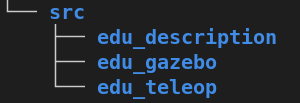
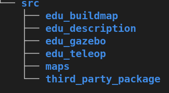

# Roboticfd

`Educational Robotic fundamental tutorials.`
# Title

| **Author(s)** | Chien Duong |
| :------------ | :-------------------------------------------------------------------------------------------- |
| **Topic(s)** | Educational Robotic / Ros / AI |
| **Status**       | **In progress** |
# Pre-requirement:
1. Ubuntu 16.04 or 18.04
2. Ros
3. Theory: https://chienduong93.wordpress.com/2021/11/18/rf-tutorial-1/
# Table of Content

0. [x] Config
1. [x] Manually control a robot in simulation
2. [x] Autonomously in Simulation: build map, run map
3. [ ] Create custom messages. And use_case example.
4. [ ] List of tips & tricks: ros param, ros launch, debug with roslog, switch topic, roslog, ros bag, public topic one time.
5. [ ] Build a Hardware
6. [ ] Robotic in Production
7. [ ] Vision based approach with AI solution: reinforcements learning, segmentation, detection.
8. [ ] Sensors fusion and fusion vision approach with sensor_base approach.
## Config 
Install Ros, gazebo, rviz.

ROS: 18.04: melodic, 16.04: kinetic

Check ubuntu version
```BASH
cat /etc/os-release
```

Install Ros
```BASH
sudo sh -c 'echo "deb http://packages.ros.org/ros/ubuntu $(lsb_release -sc) main" > /etc/apt/sources.list.d/ros-latest.list'
sudo apt-key adv --keyserver 'hkp://keyserver.ubuntu.com:80' --recv-key C1CF6E31E6BADE8868B172B4F42ED6FBAB17C654
sudo apt-get update
sudo apt-get install ros-melodic-desktop-full
```

Basic packages: should be install into the system `/opt/ros/melodic`.

```BASH
sudo apt install python-rosdep python-rosinstall python-rosinstall-generator python-wstool build-essential
sudo apt install python-rosdep
sudo rosdep init
rosdep update

sudo apt-get install ros-melodic-gazebo-ros-pkgs ros-melodic-gazebo-ros-control
sudo apt-get install ros-melodic-unique-id
sudo apt-get install ros-melodic-uuid-msgs
```

Extra packages for autonomous function.

```
sudo apt-get install ros-melodic-navigation
sudo apt-get install ros-melodic-map-server
sudo apt-get install ros-melodic-move-base
rospack profile
sudo apt-get install ros-melodic-amcl
```

Note: 
 - If you don't want to install to the system `/opt/ros`, you can download the package from any resources (example GitHub) -> put it in the `src` folder -> catkin_make to use this package

-  If you are using ubuntu 16.04 -> change `melodic` to `kinetic`

Setup Ros environment

```BASH
cd ~/education_robot_ws/
catkin_make
```
## 1. Manually control robot in simulation


To manual control robot, we only need to use 3 packages

 

 - Keyboard control
```BASH
cd  education_robot_ws
source devel/setup.bash
roslaunch edu_teleop edu_teleop_key.launch 
```
- Load gazebo and robot in environment

```BASH
cd  education_robot_ws
source devel/setup.bash
export TURTLEBOT3_MODEL="burger"
roslaunch edu_gazebo edu_empty_world.launch
```

Results:


## 2. Autonomously control robot in simulation
Autonomous in Simulation: build map, run map
- To build maps we need 3 more packages: `maps, third_party_package/gmapping, and edu_buildmap`


 

1. Build map

- Add on third_party_package/gmapping, edu_buildmap, and maps. Then build the package with catkin_make

```
cd education_robot_ws
catkin_make
```

- Run system

In each termianl, always remember to active workspace.

```
cd  education_robot_ws
source devel/setup.bash
```

Terminal 1: manual control robot
```
roslaunch edu_teleop edu_teleop_key.launch 
```

Terminal 2: observe map and robot 
```
roslaunch edu_buildmap build_map_simulation.launch
```

Terminal 3: save map after finished.
```
cd  education_robot_ws
rosrun map_server map_saver -f ./src/maps/empty_world
```

Results:


2. Autonomous naviagation

- Add on third_party_package/teb_local_planner_tutorials. Then build the package with cakin_make

- Others Pre-requirements: amcl and move_base package

```
roslaunch edu_autonomous autonomous_simulation.launch
```

Results:


Awesome Resources: 

- https://github.com/ROBOTIS-GIT/turtlebot3_simulations
- https://github.com/kiloreux/awesome-robotics
